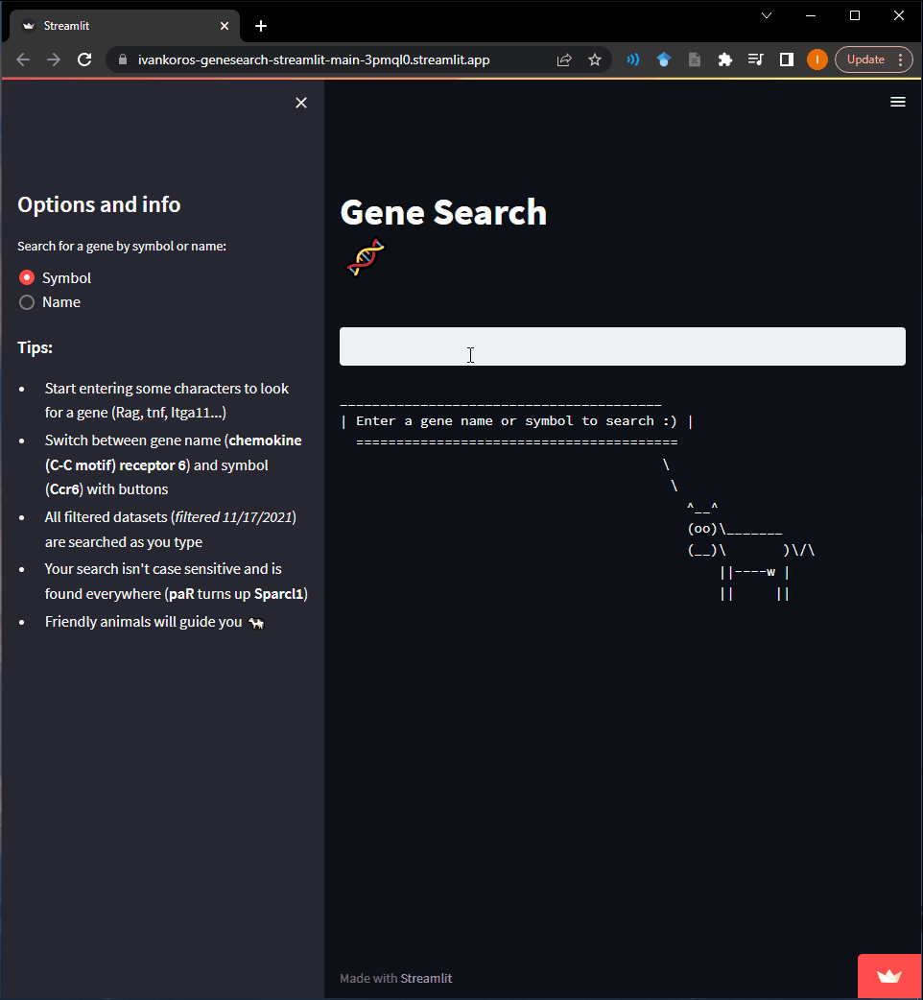

# [geneSearch-Streamlit](https://ivankoros-genesearch-streamlit-main-3pmql0.streamlit.app/)

### A high-performance Streamlit web app for exploring genome expression data with ease

Optimized for quick access to past and lab-specific published data, geneSearch-Streamlit enables users to unlock valuable mechanistic insights within seconds.

## Features

* **Real-time search**: With a 50ms delay, search results update dynamically as you type - no need for a submission button
* **Flexible query options**: Choose between gene symbols (e.g., "Rag1") or names (e.g., "Recombination activating 1") using radio buttons
* **Case-insensitive & substring search**: Find matches effortlessly, regardless of capitalization or substring location, e.g., "**rAg**" matches "13-3**RAG**fn2"
* **User-friendly guidance**: Cowsay ASCII art provides helpful hints and feedback on missing search results

## Tech Stack

* **Streamlit**: Built and hosted entirely with Streamlit
* **Pandas**: Leveraged for data preprocessing and table/dataframe visualization
* **NumPy**: Utilized for efficient data wrangling
* **Markdown**: Integrated for seamless content formatting
